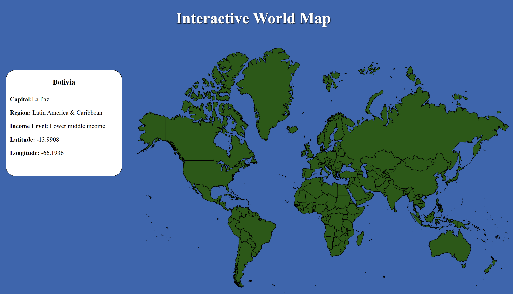

<h1>Angular Interactive Map Project</h1>

<h2> Project Description </h2>
<h3>This project uses angular to connect an svg image of a world map to an Api. This allows 
users to be able to find FAQs about each country as they explore the map, by  
hovering their cursor over it.</h3>
 
<h2> How to Run</h2>
<h3>Download zip file of project, and run " ng serve -- open" in command line</h3>
